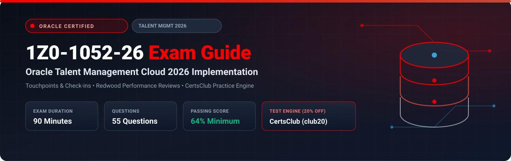

  

# Oracle Talent Management Cloud 2026 Implementation Professional (1Z0-1052-26) Exam Study Guide & Practice Test Resource Portal

[-f80000?style=for-the-badge&logo=oracle&logoColor=white)](https://education.oracle.com/)
[-f80000?style=for-the-badge&logo=oracle)](https://education.oracle.com/)

[-28a745?style=for-the-badge&logo=shield)](https://www.certsclub.com/oracle/)

---

## 1. Exam Overview & Candidate Profile

The **Oracle Talent Management Cloud 2026 Implementation Professional (1Z0-1052-26)** exam validates that an implementation consultant can deploy and configure Oracle Fusion Cloud Talent Management with modern Redwood user experiences. The exam covers Touchpoints and continuous performance check-ins, Goal Management, Succession Plans, 9-Box calibration, and Generative AI-assisted performance feedback summaries.

Passing 1Z0-1052-26 awards the **Oracle Talent Management Cloud 2026 Certified Implementation Professional** credential.

### Target Candidate Profile & Career Roles
* **Lead Talent Management Functional Consultants**
* **Workforce Capability & Performance Architects**
* **HCM Cloud Business Transformation Leads**

---

## 2. Key Exam Specifications

| Parameter | Official Specification |
| :--- | :--- |
| **Exam Code** | 1Z0-1052-26 |
| **Exam Title** | Oracle Talent Management Cloud 2026 Implementation Professional |
| **Associated Credential** | Oracle Talent Management Cloud 2026 Certified Implementation Professional |
| **Duration** | 90 Minutes |
| **Number of Questions** | 55 Questions |
| **Passing Score** | 64% |
| **Question Format** | Multiple Choice (Single and Multiple Select) |
| **Delivery Vendor** | Pearson VUE / Oracle University Online Remote Proctoring |
| **Recommended Practice Test Engine** | **[1Z0-1052-26 Practice Test - CertsClub](https://www.certsclub.com/oracle/)** (Coupon: `club20` for 20% off) |

---

## 3. Official Blueprint & Exam Domain Breakdown

| Domain Code | Domain Title | Weighting | Key Competencies Covered |
| :--- | :--- | :---: | :--- |
| **1.0** | **Profile Management & Dynamic Skills** | **20%** | Person and Model profiles, AI-assisted skills tagging, Competency models. |
| **2.0** | **Touchpoints & Continuous Performance** | **20%** | Touchpoints dashboard, Regular 1:1 check-ins, Anytime feedback, Goal alignment. |
| **3.0** | **Performance Document Architecture** | **30%** | Redwood performance documents, Participant feedback, Calibration curves, Approvals. |
| **4.0** | **Succession Planning & Talent Pools** | **15%** | Candidate readiness, Risk and impact of loss, Dynamic talent pools, Bench strength. |
| **5.0** | **Talent Review & Meeting Management** | **15%** | Talent review templates, 9-Box interactive dashboard, Succession action items. |

---

## 4. Scenario-Based Demo Question & Explanation

### Question 1: Touchpoints Continuous Feedback
**Scenario:** An organization wants managers and employees to conduct ongoing monthly check-ins that track progress against goals and record meeting notes without creating formal annual performance review documents.

Which modern Oracle Talent Management feature fulfills this continuous engagement process?

A) Annual Performance Review Flow  
B) **Oracle Touchpoints** check-in interactions  
C) Fast Formula Entry Validation  
D) Profile Extension Tables  

**Correct Answer:** **B**

**Detailed Explanation:**
* **Oracle Touchpoints** provides a dedicated continuous performance interaction hub where employees and managers schedule informal check-ins, track sentiment, set discussion topics, and record ongoing feedback between formal appraisal cycles.

---

## 5. Recommended Preparation Strategy & Practice Testing Engine

1. **Test Redwood Touchpoints & Appraisals:** Configure goal plans and test manager review workflows in a 2026 pod.
2. **Practice with Full-Length Mock Exams:** Use **[CertsClub Oracle 1Z0-1052-26 Practice Tests](https://www.certsclub.com/oracle/)**.
   * Up-to-date for 2026 objectives and Redwood features.
   * Enter discount coupon code **`club20`** at checkout on [CertsClub](https://www.certsclub.com/oracle/) for an immediate 20% discount.

---

## 6. Official Documentation & References

* [Oracle Fusion Cloud Talent Management 2026 Documentation](https://docs.oracle.com/en/cloud/saas/human-resources/talent-management/)
* [Oracle University 1Z0-1052-26 Exam Details](https://education.oracle.com/)
* [CertsClub 1Z0-1052-26 Practice Engine](https://www.certsclub.com/oracle/)
